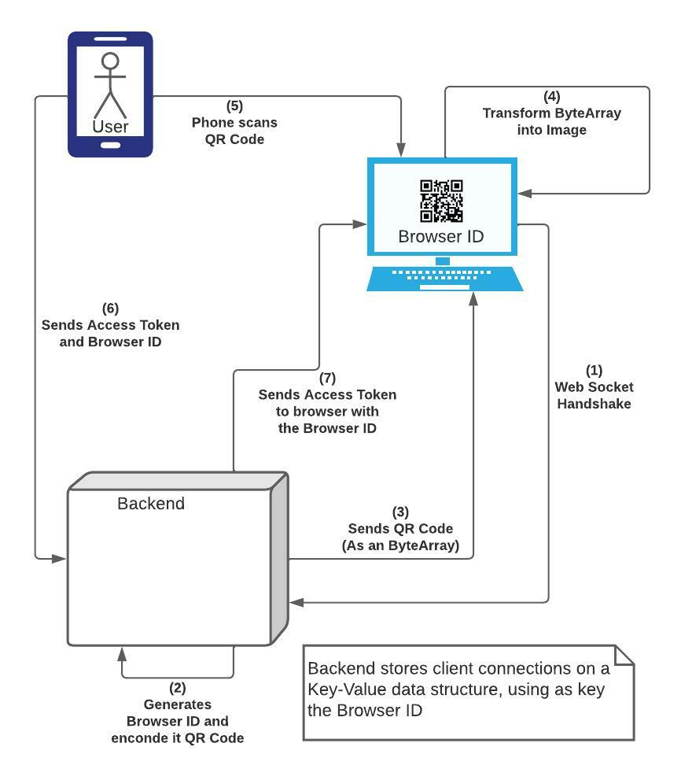
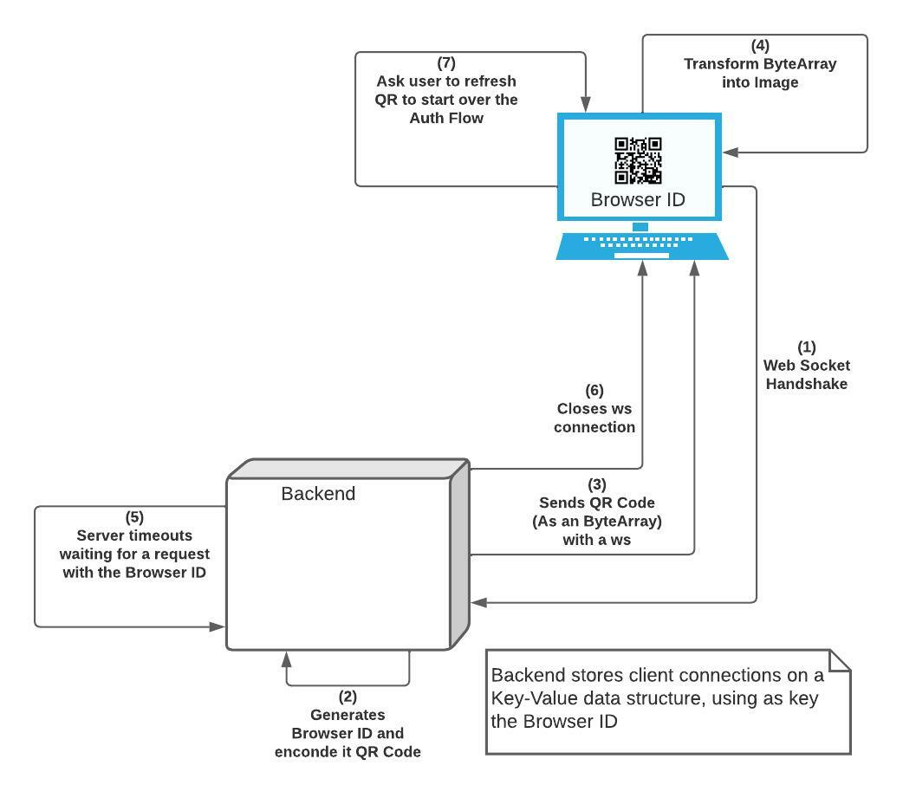

QR Auth Login
---

### URL: https://snappy-thought-287317.uc.r.appspot.com

## Description:
Authentication via QR code inspired on WhatsApp Web QR Login.
---

## How to run:
If mock data is needed, use the ```addUser.sql``` file on doc folder

### Backend Standalone
1. Go to the root folder
2. Execute ````gradlew build````
3. Execute ````gradlew bootRun````
4. All backend endpoints have ```/api/``` prefix

### Frontend Standalone
1. Go to frontend folder/package
2. Execute ````yarn install```` or ```npm install```
3. Execute ````yarn start```` or ```npm start```

### Backend with React:
Keep in mind that there will not be hot reload, because the backend uses the Vite compiled version of the React App
1. Go to the root folder
2. Execute ````gradlew build````
3. Execute ````gradlew bootRun````
---
## Made with:
- Gradle 7.5.1
- SpringBoot 5
- React + TS + Vite
- WebSockets

---
## How it works?
- Normal Flow 



- QR Scan code Timeout


## TODO:
### BackEnd:
1. Enable WS Connection for Spring
2. Create Key-Value Store for Browser ID
3. Define topics for ws messages
4. Send Browser ID via WS
5. Endpoint for managing mobile user confirmation
6. Send Auth Token via WS
7. Role management
8. Secure endpoints with authentication and authorization

### Frontend:
1. Backend HTTP Request
2. Backend WS Request
3. Render QR Code from ByteArray
4. Scan QR Code from browser
5. Secure views with authentication and authorization

### Cool Stuff:
1. Migrate from ```useEffect``` hook to ```React Query```
2. Migrate from ```Bootstrap & React-Bootstrap``` to ```TailWind CSS```

---
## Special thanks to:
1. [Hayageek](https://github.com/hayageek/WhatsApp-Web) for the explanation
